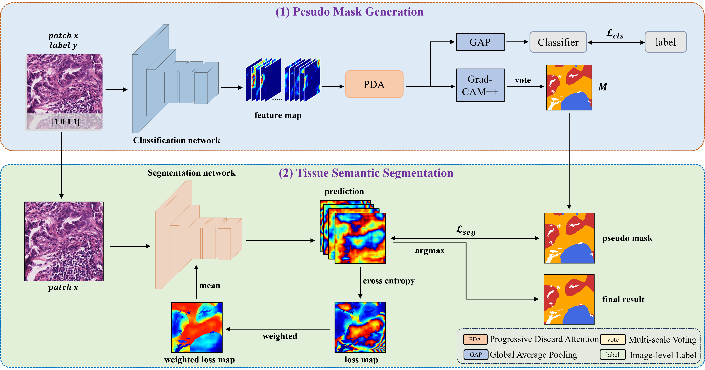

# Framework




# Weakly-supervised Classification part

## Pretrained weights and datasets

Download the pretained weight of classification stage via Google Cloud Drive ([Link)](https://drive.google.com/file/d/1fKSFyWgJ8dZqGMFsJEiFwcCyUlbjvhrJ/view?usp=drive_link)

Download the datasets via Google Cloud Drive ([Link)](https://drive.google.com/file/d/1lWAeCp6UN30VRVmqv97kA2sJ1Pp2frhC/view?usp=drive_link)([Link)](https://drive.google.com/file/d/178eSM9xs5jITt5P2kjaswDlJzwlU5gps/view?usp=drive_link)

## Training classification model and generate pesudo masks

1、Train the classification model:

```python
python 1_train_stage1.py
```

2、generate pesudo masks with the image-level label:

```python
python 2_generate_PM.py
```

# Weakly-supervised Semantic Segmentation part

## Introduction

### Data Preparation
1. Download pretrained models [OneDrive](https://1drv.ms/f/s!Agn5nXKXMkK5aigB0g238YxuTxs)
2. Download dataset WSSS GlaS [OneDrive]()

### Get Started
    (1. preparation)
    git clone OEEM
    cd OEEM
    ln -s [path to WSSS GlaS] glas
    ln -s [path to pretrained models] models
    
    (2. install mmsegmentation and mmcv)
    pip install mmcv==1.1.5
    pip install -e .
    
    (3. train)
    bash tools/dist_train.sh configs/pspnet_oeem/pspnet_wres38-d8_10k_histo.py 1 runs/oeem
    
    (4. inference, patch merge and evaluation)
    bash tools/dist_test.sh configs/pspnet_oeem/pspnet_wres38-d8_10k_histo_test.py [path to best checkpoint] 1
    python tools/merge_patches.py glas/test_patches glas/test_merged 2
    python tools/count_miou.py glas/test_merged [path to original val gt] 2


